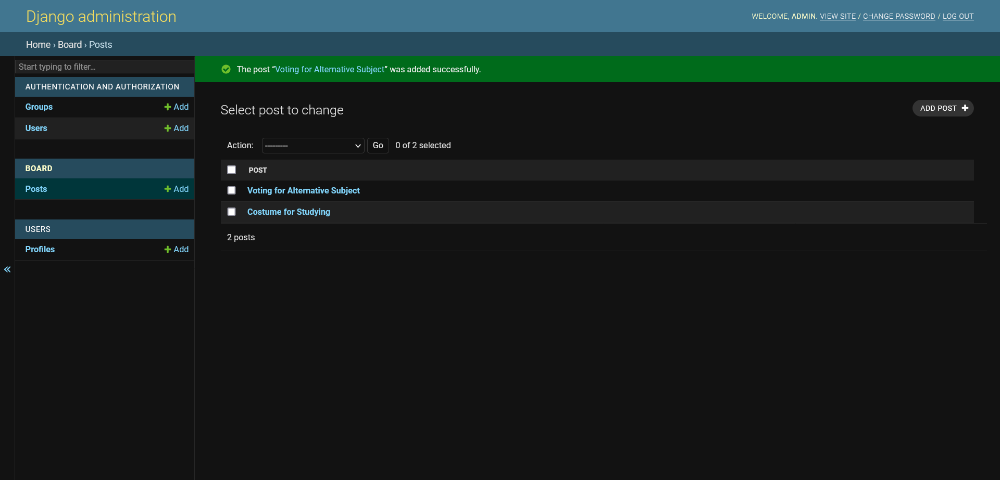

# VotingBoard
VotingBoard is a website which admin can create a voting board and people who have an account can vote on the board.
# Admin Account
An admin account is already created, by which username of the admin is set to be "admin" and password of the admin is set to be "adminpassword".
You can you use "python manage.py changepassword <user_name>" command to set new password of the admin.
# Web Screen

Use admin page to create a voting board.

